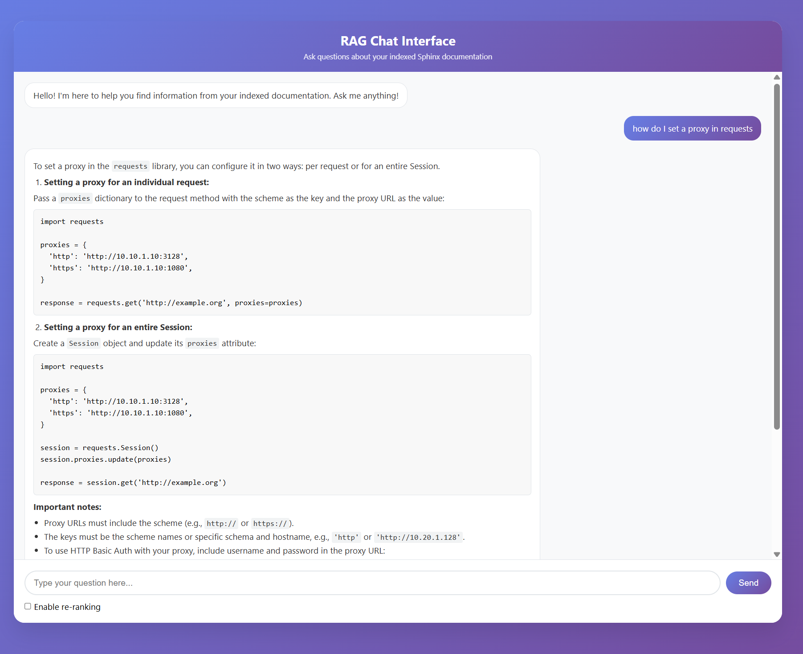

# RAG Pipeline for Sphinx Documents



A Retrieval-Augmented Generation (RAG) pipeline that indexes and queries Sphinx documentation using vector embeddings and PostgreSQL with pgvector.

## Features

- Parse and index .rst (reStructuredText) files
- **Configurable vector embeddings**: Choose between **Mistral AI** or **OpenAI** embeddings
- Keyword extraction using YAKE
- PostgreSQL database with pgvector for similarity search
- Question answering using OpenAI GPT models
- Optional result re-ranking with keyword overlap scoring
- **Web-based chat interface** for easy interaction
- FastAPI backend with REST API
- Docker containerization with modern Python tooling (uv)

## Prerequisites

- Docker and Docker Compose
- API keys for:
  - **Mistral AI** (for embeddings when using Mistral provider) - Get yours at [console.mistral.ai](https://console.mistral.ai)
  - **OpenAI** (for question answering and embeddings when using OpenAI provider)

## Embedding Provider Configuration

The system supports two embedding providers that you can toggle between in your `.env` file:

### Mistral AI Embeddings (Default)
- **Model**: `mistral-embed`
- **Dimensions**: 1024
- **Advantages**: Cost-effective, good performance
- **Configuration**:
  ```bash
  EMBEDDING_PROVIDER=mistral
  MISTRAL_API_KEY=your_mistral_api_key_here
  ```

### OpenAI Embeddings
- **Model**: `text-embedding-3-small` (configurable)
- **Dimensions**: 1536
- **Advantages**: High quality, well-tested
- **Configuration**:
  ```bash
  EMBEDDING_PROVIDER=openai
  OPENAI_API_KEY=your_openai_api_key_here
  OPENAI_EMBEDDING_MODEL=text-embedding-3-small  # Optional, defaults to text-embedding-3-small
  ```

### Switching Between Providers

1. **Update your `.env` file** with the desired `EMBEDDING_PROVIDER`
2. **Restart the services**: `docker-compose down && docker-compose up -d`
3. **Re-index your documents** if switching providers (embeddings are not compatible between providers):
   ```bash
   docker-compose exec app python main.py setup
   docker-compose exec app python main.py index ./docs/
   ```

**Note**: When switching embedding providers, you'll need to re-index your documents as the embedding dimensions and vector spaces are different between providers.

## Quick Start

1. **Clone or download the project files**

2. **Set up environment variables**
   Create a `.env` file in the project root with your API keys:
   ```bash
   # Copy the example file and edit it
   cp .env.example .env
   # Then edit .env with your actual API keys
   ```
   
   Your `.env` file should look like:
   ```
   MISTRAL_API_KEY=your_mistral_api_key_here
   OPENAI_API_KEY=your_openai_api_key_here
   OPENAI_API_BASE=https://api.openai.com/v1
   MISTRAL_MODEL=mistral-embed
   OPENAI_MODEL=gpt-4-turbo
   ```

3. **Start the services**
   ```bash
   docker-compose up -d
   ```

4. **Set up the database**
   ```bash
   docker-compose exec app python main.py setup
   ```

5. **Index your documents**
   ```bash
   # Place your .rst files in the ./docs directory, then:
   docker-compose exec app python main.py index ./docs/
   ```

6. **Start chatting!**
   - **Web Interface**: Open `http://localhost:8000` in your browser
   - **CLI**: `docker-compose exec app python main.py query "Your question here"`

## Recent Updates (June 2025)

### ✅ Fixed Mistral Client Compatibility
- **Updated to Mistral AI client v1.x**: Migrated from deprecated v0.x client
- **New API methods**: Using `client.embeddings.create()` instead of legacy `client.embeddings()`
- **Improved error handling**: Better separation of database setup vs. API operations
- **Version pinning**: `mistralai>=1.0.0` ensures compatibility

### 🚀 Performance Improvements
- **Lazy client initialization**: API clients only created when needed
- **Optimized Docker builds**: Multi-stage builds with dependency caching
- **Modern Python tooling**: Using `uv` for faster dependency resolution

## Usage

### Index Documents

To index .rst files or directories containing .rst files:

```bash
# Index a single file
docker-compose exec app python main.py index /path/to/file.rst

# Index a directory (recursively finds all .rst files)
docker-compose exec app python main.py index ./docs/

# Index multiple paths
docker-compose exec app python main.py index ./docs1/ ./docs2/ ./file.rst
```

### Web Chat Interface

After starting the services, you can access the web-based chat interface:

1. **Open your browser** and go to: `http://localhost:8000`
2. **Start chatting** with your indexed documentation
3. **Enable re-ranking** using the checkbox for potentially better results

### Command Line Interface

To ask questions about the indexed documents via CLI:

```bash
# Basic query
docker-compose exec app python main.py query "How do I configure the database?"

# Query with re-ranking enabled
docker-compose exec app python main.py query "What are the available API endpoints?" --rerank
```

### API Endpoints

The application provides multiple interfaces:

#### Web Interface (app.py - port 8000)
- `GET /` - Web chat interface
- `POST /chat` - Send a message and get a response
- `GET /health` - Health check endpoint

#### OpenAI-Compatible API (main.py serve - port 8000)
- `POST /v1/chat/completions` - OpenAI-compatible chat completions endpoint
- `GET /v1/models` - List available models
- `GET /health` - Health check endpoint

#### Command Line Interface
```bash
# Setup database
python main.py setup

# Index documents
python main.py index ./docs/

# Query documents
python main.py query "Your question here" [--rerank]

# Start OpenAI-compatible API server
python main.py serve [--host 0.0.0.0] [--port 8000]
```

### Testing the OpenAI-Compatible API

The project includes test scripts to verify the OpenAI-compatible endpoint:

#### PowerShell (Windows)
```powershell
# Run the PowerShell test script
.\test_openai_api.ps1
```

#### Bash (Linux/macOS)
```bash
# Make the script executable and run it
chmod +x test_openai_api.sh
./test_openai_api.sh
```

#### Manual curl test
```bash
# Test the chat completions endpoint
curl -X POST http://localhost:8000/v1/chat/completions \
  -H "Content-Type: application/json" \
  -d '{
    "model": "gpt-4-turbo",
    "messages": [
      {"role": "user", "content": "What is this documentation about?"}
    ],
    "temperature": 0.7
  }'

# Test the models endpoint
curl http://localhost:8000/v1/models
```

#### Using with OpenAI Python Client
```python
from openai import OpenAI

# Point to your local RAG server
client = OpenAI(
    api_key="dummy-key",  # Not used but required by client
    base_url="http://localhost:8000/v1"
)

response = client.chat.completions.create(
    model="gpt-4-turbo",
    messages=[
        {"role": "user", "content": "How do I configure the database?"}
    ]
)

print(response.choices[0].message.content)
```

## Troubleshooting

### Common Issues

1. **"NotImplementedError: This client is deprecated"**
   - ✅ **FIXED**: Now using Mistral client v1.x
   - If you see this, rebuild your containers: `docker-compose up -d --build`

2. **"vector type not found in the database"**
   - ✅ **FIXED**: Improved database setup process
   - Run: `docker-compose exec app python main.py setup`

3. **API Key Issues**
   - Ensure your `.env` file is properly configured
   - Check that your Mistral API key is valid at [console.mistral.ai](https://console.mistral.ai)
   - Verify OpenAI API key permissions

4. **Permission Issues with Docs**
   - Ensure the `./docs` directory exists and is readable
   - On Windows, you may need to run as Administrator for symlinks

## Local Development

If you prefer to run without Docker:

1. **Install uv (recommended)**
   ```bash
   # macOS/Linux
   curl -LsSf https://astral.sh/uv/install.sh | sh
   
   # Windows
   powershell -ExecutionPolicy ByPass -c "irm https://astral.sh/uv/install.ps1 | iex"
   ```

2. **Install dependencies**
   ```bash
   # Using uv (recommended)
   uv pip install .
   
   # Or using pip
   pip install -r requirements.txt
   ```

3. **Set up PostgreSQL with pgvector**
   - Install PostgreSQL
   - Install the pgvector extension
   - Create a database and user

4. **Set environment variables**
   ```bash
   export DB_HOST=localhost
   export DB_PORT=5432
   export DB_NAME=rag_db
   export DB_USER=rag_user
   export DB_PASSWORD=rag_password
   export MISTRAL_API_KEY=your_mistral_api_key
   export OPENAI_API_KEY=your_openai_api_key
   export OPENAI_API_BASE=https://api.openai.com/v1
   ```

5. **Run the application**
   ```bash
   python main.py setup
   python main.py index /path/to/docs/
   python main.py query "Your question here"
   
   # Or start the web interface
   python app.py
   ```

## Architecture

- **main.py**: Core application with RAG pipeline implementation
- **app.py**: FastAPI web server with chat interface
- **pyproject.toml**: Modern Python project configuration with dependencies
- **requirements.txt**: Legacy Python dependencies (for compatibility)
- **Dockerfile**: Multi-stage container build using uv for fast dependency installation
- **docker-compose.yml**: Multi-service setup with PostgreSQL, CLI app, and web interface

## Database Schema

- **documents**: Stores document content and vector embeddings (1024 dimensions for Mistral, 1536 for OpenAI)
- **functions**: Extracted function signatures from Sphinx documents
- **keywords**: Extracted keywords using YAKE for enhanced search

## Configuration

The application uses environment variables for configuration:

**Embedding Provider:**
- `EMBEDDING_PROVIDER`: Choose between "mistral" or "openai" (default: "mistral")

**Database:**
- `DB_HOST`, `DB_PORT`, `DB_NAME`, `DB_USER`, `DB_PASSWORD`: Database connection

**AI Services:**
- `MISTRAL_API_KEY`: For Mistral embeddings (required when EMBEDDING_PROVIDER=mistral)
- `OPENAI_API_KEY`, `OPENAI_API_BASE`: For question answering and OpenAI embeddings (required)
- `MISTRAL_MODEL`: Mistral embedding model (default: "mistral-embed")
- `OPENAI_MODEL`: OpenAI model for question answering (default: "gpt-4-turbo")
- `OPENAI_EMBEDDING_MODEL`: OpenAI embedding model (default: "text-embedding-3-small")

## Dependencies

**Key packages:**
- `mistralai>=1.0.0` - Latest Mistral AI client
- `openai` - OpenAI API client
- `psycopg2-binary` - PostgreSQL adapter
- `pgvector` - Vector similarity search
- `docutils` - reStructuredText parsing
- `fastapi` - Web framework
- `yake` - Keyword extraction

## Contributing

When making changes:
1. Update dependencies in `pyproject.toml`
2. Rebuild containers: `docker-compose up -d --build`
3. Test with: `docker-compose exec app python main.py setup`
4. Update documentation as needed
